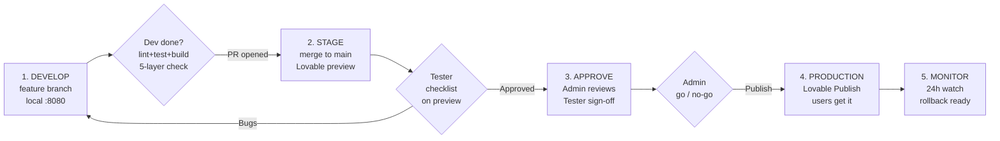

# Release & Approval Process

How a change travels from a developer's branch to the users' screens in Marshmallow.

This is a **change-management workflow with separation of duties**: the person who writes a
change is never the person who ships it. It is mapped onto the tools we already use — GitHub
pull requests, the Lovable **preview** and **production** environments, and the Vitest/SQL
test harnesses — so there is nothing new to install.

The guiding fact for our stack: **Lovable deploys from `main`, but users only receive a change
when an Admin clicks "Publish changes."** That makes **Publish the single production gate**.
`main` + the preview URL are therefore our *staging* environment, and the Admin's Publish click
is the final human go/no-go that this process is built around.

---

## Roles & responsibilities

| Role | Does | Cannot |
|---|---|---|
| **Developer / Optimizer** | Builds the change on a branch, opens a PR explaining it, fixes bugs the Tester reports, verifies the five layers (see `CLAUDE.md`) | ❌ Merge to `main` · ❌ Publish |
| **Tester (QA)** | Tests on the **preview** env against the checklist, files bugs, suggests improvements, gives a formal **Approved** sign-off (a GitHub PR review) | ❌ Merge · ❌ Publish |
| **Admin (Release Manager)** | Assigns the Tester, reviews the sign-off, **merges to `main`**, clicks **Publish** in Lovable, owns rollback | — (final authority) |
| **Other Users** | Keep working; receive only published changes | ❌ See unpublished / unfinished work |

**Separation of duties — the hard rules:**

- A Developer never approves their own change. The **Tester's** approval is required.
- Merge and Publish are **Admin-only**. Keep `main` protected on GitHub and keep the Lovable
  Publish seat with the Admin, so these rules are enforced by tooling and not just agreement.

---

## The flow

### Stage 1 — Develop *(Developer / Optimizer)*
- Work on a feature branch (e.g. `m.kashif/<feature>`), never directly on `main`.
- Open a PR to `main` that **explains the change** and lists what the Tester should check.
- **Exit criteria:** `npm run lint`, `npm test`, and `npm run build` all clean; the five-layer
  verification done for any role/permission change; PR description filled in.

### Gate 1 → Stage 2 — Stage / Test *(Admin promotes; Tester tests)*
- Admin merges the PR to `main`. Lovable reflects it on the **preview** URL
  (`preview--marshmallow-crm.lovable.app`) — **but does not Publish**, so real users still see
  the old version.
- Tester tests on preview against the checklist, files bugs as PR comments / issues, suggests
  improvements.
- **Exit criteria:** every checklist item passes; Tester posts a formal **"Approved — tested on
  preview"** review on the PR. Any bug sends it back to Stage 1.

### Gate 2 → Stage 3 — Approve *(Admin)*
- Admin reviews the Tester's sign-off and results, and confirms scope, risk, and timing
  (avoid publishing right before everyone logs off).
- **Exit criteria:** Admin records a go / no-go decision.

### Gate 3 → Stage 4 — Publish *(Admin only)*
- Admin clicks **"Publish changes"** in Lovable. Users receive the update on next refresh.
- Admin adds a line to `CHANGELOG.md` (date, PR #, what shipped, who tested).

### Stage 5 — Monitor *(Admin + Developer on standby)*
- Watch for ~24 hours. If something breaks, **roll back** (see below).

---

## Tester checklist (what "tested" means)

A change is **tested** only when, on the **preview** environment:

1. The feature does what the PR says, for the roles it targets.
2. A role that should *not* see it, doesn't (permission check).
3. No regression on the main lead flow (create → status change → the affected screen).
4. If it touched RLS / permissions: the relevant `supabase/tests/*.sql` harness was run and
   every row is `PASS` (e.g. `40_leads_rls_baseline.sql` diffed before and after).
5. No new console errors, and the page loaded a fresh build (not a stale one).

---

## Rollback & emergency hotfix

- **Rollback:** if a published change misbehaves, the Admin reverts the PR on `main`
  (`git revert`) and Publishes again — forward-fix by undo. Fastest safe path; keeps history.
- **Hotfix (production on fire):** Developer branches from `main`, fixes, opens a PR marked
  **HOTFIX**; Tester does an abbreviated smoke test on preview; Admin fast-tracks the merge and
  Publish. The gates are compressed, not skipped — **Publish stays Admin-only even in a fire.**

---

## Audit trail

Running the flow through GitHub plus a changelog gives a complete, attributed history for free:

- **The PR** holds the change, the Developer's explanation, the Tester's approval review, and
  the Admin's merge — immutable, timestamped, attributed.
- **`CHANGELOG.md`** is the human-readable release history: one line per release.

---

## Quick reference

| Step | Who | Where |
|---|---|---|
| Build + open PR | Developer | feature branch → PR to `main` |
| Merge to staging | Admin | GitHub |
| Test + approve | Tester | Lovable **preview** |
| Review sign-off | Admin | GitHub PR |
| **Publish** | **Admin** | Lovable **production** |
| Record release | Admin | `CHANGELOG.md` |
| Monitor / rollback | Admin + Developer | production |
